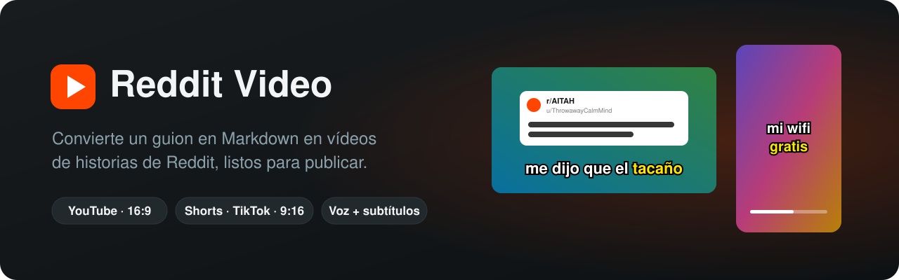
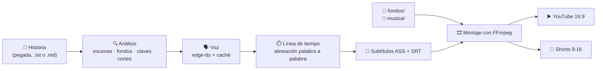

<p align="center">
  
</p>

<p align="center">
  
  
  
  
  
</p>

<p align="center">
  <a href="#instalación">Instalación</a> ·
  <a href="#uso">Uso</a> ·
  <a href="#cortes-automáticos-de-los-shorts">Cortes automáticos</a> ·
  <a href="#formato-del-guion">Formato del guion</a> ·
  <a href="#obsidian">Obsidian</a> ·
  <a href="#configuración">Configuración</a> ·
  <a href="#hoja-de-ruta">Hoja de ruta</a>
</p>

---

**Reddit Video** es una app de escritorio para Windows que convierte una historia en texto (pegada en la app, un `.txt` o una nota `.md`) en vídeos de historias de Reddit listos para publicar: un vídeo completo para **YouTube** y una serie de **shorts verticales** para TikTok, Reels y YouTube Shorts que terminan en cliffhanger. La app decide sola dónde cortar. La voz en off, los subtítulos, la tarjeta del post y los fondos se generan solos.

## Características

| | |
|---|---|
| 🎬 **Dos formatos a la vez** | Vídeo completo 16:9 con su `.srt` para YouTube y shorts 9:16: los del *Mapa de cortes* de la nota o, si no lo trae, calculados solos. |
| ✂️ **Cortes automáticos** | Parte la historia en shorts de ~2:30 que acaban en un punto de suspense y deja el final para YouTube. |
| 📋 **Cualquier texto** | Pega la historia tal cual en la app o abre un `.txt`: no hace falta ningún formato especial ni Obsidian. |
| 🗣️ **Voz en off gratis** | Con el motor de **Texto a Voz** (incluida en `Texto_Voz\`, voces neuronales de Microsoft vía [edge-tts](https://github.com/rany2/edge-tts)). Once voces en español (España, México, EE. UU., Colombia y Argentina); cada proyecto sortea una y la recuerda. |
| 💬 **Subtítulos palabra a palabra** | De 2 a 4 palabras por golpe, sincronizados con la voz, con zoom en las frases en **negrita** y palabras clave en amarillo. |
| 🟧 **Tarjeta de Reddit** | El vídeo arranca con un post que imita uno real (`r/subreddit`, `u/usuario` y título), editable con vista previa. |
| 🧼 **Fondos por temática** | Clips *satisfying* o de gameplay (`JABON`, `SLIME`, `ARENA`, `PINTURA`, `PRENSA`, `RUNNER`, `PARKOUR`, `CERA`), recortados o sobre fondo desenfocado según el formato. Un único tema por short. |
| 📓 **Integración con Obsidian (opcional)** | Lee las notas de tu bóveda, marca los clips hechos en el checklist y actualiza el estado de la nota. |
| ⚡ **Rápido y con caché** | Aceleración por GPU NVIDIA (NVENC), modo de prueba rápida y caché de voz por línea: solo se regenera lo que cambia. |

## Cómo funciona



Los vídeos se guardan en `salida\<nombre del guion>\`.

## Instalación

> **Requisitos:** Windows 10/11 y conexión a internet (la voz se genera online). El instalador se encarga de Python, edge-tts y FFmpeg.

1. **Descarga el proyecto** con **Code → Download ZIP** (o la última versión en **Releases**) y descomprímelo donde quieras.
2. **Haz doble clic en `INSTALAR_Y_CREAR.bat`.** Instala lo que falte (Python 3.12, las dependencias de `requirements.txt` y FFmpeg mediante `winget`) y abre la app.
3. **Añade fondos.** La primera vez se crean las carpetas `fondos\JABON`, `SLIME`, `ARENA`, `PINTURA`, `PRENSA`, `RUNNER`, `PARKOUR` y `CERA`. Mete en cada una algún clip gratuito de Pexels o Pixabay (busca *soap cutting*, *slime*, *kinetic sand*, *paint pouring*, *hydraulic press*, *wax cutting*…).
   - Valen en vertical u horizontal: en los shorts se recortan y en YouTube se colocan sobre un fondo desenfocado.
   - Si una carpeta está vacía, se usa otra que tenga clips.
   - Un vídeo de más de 15 minutos se reutiliza para toda su temática, cogiendo trozos seguidos para no repetir.
4. **Música (opcional).** Mete archivos `.mp3` en `musica\` (por ejemplo, de la YouTube Audio Library o Pixabay Music).
5. **Historias.** No hace falta nada más: pulsa **＋ Pegar historia…** en la app y pega el texto tal cual. Si usas Obsidian, pulsa **Conectar Obsidian…** y elige tu bóveda (lee `02_Clips` o `03_Guiones`). También vale cualquier carpeta con `.md` o `.txt`, y en `guiones\` hay un ejemplo.

A partir de ahí, basta con abrir **`crear_video.bat`**. Para convertir cualquier texto a audio sin hacer vídeo, abre **`texto_a_voz.bat`** (la web de Texto a Voz).

<details>
<summary><b>Instalación manual</b> (sin el <code>.bat</code>)</summary>

```bat
winget install -e --id Python.Python.3.12
winget install -e --id Gyan.FFmpeg
python -m pip install -r requirements.txt
pythonw app.pyw
```

</details>

## Uso

### Desde la app

Abre **`crear_video.bat`** y sigue las cuatro tarjetas:

1. **Historia.** **＋ Pegar historia…** (título, subreddit y el texto tal cual; se guarda como nota en la carpeta de guiones) o elige una nota de la lista (la más reciente primero, con su estado de Obsidian: `pendiente`, `en-produccion`, `hecha`…). Debajo ves cuánto dura, cuántos shorts salen y qué parte va solo en YouTube. **Abrir nota** la abre en Obsidian. Avisa si faltan clips en alguna carpeta de fondos.
2. **Post de Reddit.** El subreddit sale de la ficha de la historia y el usuario se inventa al azar (🎲 para otro). Todo es editable y a la derecha ves cómo quedará la tarjeta.
3. **Voz.** Cada proyecto nuevo sortea una voz y la recuerda. **🎲 Otra al azar** para cambiarla y **▶ Escuchar** para oírla.
4. **Qué crear.** YouTube, Shorts o los dos; música; prueba rápida; gráfica NVIDIA.

Pulsa **Crear vídeos**: al terminar se abre la carpeta con el resultado. La voz, el subreddit y el usuario de cada proyecto se guardan en `.cache\proyectos.json`.

### Desde la terminal

```bash
python guion_a_video.py [historia.md|historia.txt] [opciones]
```

Sin ruta, usa la nota o el texto más reciente de la carpeta de guiones.

| Opción | Descripción |
|---|---|
| `--analizar` | Solo muestra lo que ha entendido del guion (escenas, fondos, claves y cortes). |
| `--solo <qué>` | `todo` (por defecto), `youtube`, `cortes`, `parte1`, `parte2`… |
| `--rapido` | Prueba rápida a media resolución. |
| `--gpu` | Codifica con NVIDIA NVENC: mucho más rápido. |
| `--voz <id>` | Fuerza una voz, p. ej. `es-ES-ElviraNeural`. |
| `--velocidad <±N%>` | Velocidad de la voz, p. ej. `"+10%"`. |
| `--musica <archivo>` | Usa esa pista en lugar de una al azar de `musica\`. |
| `--sin-musica` | Sin música de fondo. |
| `--semilla <n>` | Repite exactamente la misma elección de fondos. |

Ejemplo de `--analizar` con el guion incluido:

```text
📄 ejemplo_vecino-wifi.md
   Título tarjeta: ¿Soy el malo por cortarle el wifi a mi vecino después de un año pagándolo yo?
   Escena  1 · Gancho                             [SLIME] 3 líneas  claves: gratis, tacaño
   Escena  2 · Cómo empezó                        [ARENA] 5 líneas
   Escena  3 · La factura                         [PARKOUR] 6 líneas  claves: la mitad
   Escena  4 · Cierre + pregunta                  [SLIME] 4 líneas
   ✂️  Short 1/2: escenas 1→2
   ✂️  Short 2/2: escenas 3→4
```

La voz se guarda en caché (`.cache\tts`): si solo cambias fondos o música, no se vuelve a generar, y si cambias una frase, solo se regenera esa línea.

## Cortes automáticos de los shorts

Si la nota no trae *Mapa de cortes* (o es un texto normal), la app parte la historia ella sola:

- **Duración.** Busca shorts de ~2:30 de voz: mínimo 1:01, que es lo que paga TikTok, y máximo 2:50, para que YouTube los trate como Shorts (llegan hasta 3:00).
- **Dónde corta.** Entre frases, nunca a mitad, y prefiere los puntos de suspense: frases que acaban en «…», «?» o «:», remates cortos («Eso fue mi primer error.»), finales de sección o justo antes de un giro («Pero…», «De repente…», «Hasta que…»).
- **El final, solo en YouTube.** Los shorts llegan hasta el mejor cliffhanger hacia el 80 % de la historia. El resto solo está en el vídeo largo, y el último short acaba con «El FINAL en YouTube».
- **Fondos.** Un único tema por short, distinto del anterior.
- **Pistas que ayudan (opcionales).** Secciones con `#` o líneas tipo «PARTE 2/8 · El giro» o «Capítulo 3»: no se leen en voz alta y la app las tiene en cuenta como buenos sitios para cortar. En las notas de `01_Historias` lee desde «## Historia adaptada». Arregla solo los textos mal pegados de la web (párrafos convertidos en espacios, «frase.Otra» sin espacio).
- **Estimación y voz real.** Antes de crear se calculan con una estimación de la voz (calibrada: ~0,05 s por letra); al crear se recalculan con la voz real, así que puede moverse algún corte un par de frases.
- **Dónde verlos.** En el registro: cada short con su duración, cómo empieza y en qué frase termina. Desde la terminal: `python guion_a_video.py "historia.txt" --analizar`.

Se ajusta en `CONFIGURACIÓN` (ver [Configuración](#configuración)). `python test_cortes.py` comprueba que todo sigue cortando bien.

## Formato del guion

No hace falta ninguno: un texto normal vale. Si quieres controlar escenas, fondos, palabras en amarillo y cortes a mano, parte de [`guiones/ejemplo_vecino-wifi.md`](guiones/ejemplo_vecino-wifi.md). Un guion se ve así:

```markdown
---
subreddit: r/AITAH
---

Tarjeta inicial con el título "¿Soy el malo por cortarle el wifi a mi vecino…?"

### ESCENA 1 · Gancho
**Narración:**
Durante un año, mi vecino usó mi wifi gratis.
**me dijo que el tacaño era yo.**

**Fondo / edición:** [SLIME]. Palabras en amarillo: "gratis", "tacaño".

## Mapa de cortes

| Parte | Escenas | Duración aprox. |
|------|---------|-----------------|
| **Parte 1/2** | 1 → 2 | ~0:30 |
| **Parte 2/2** | 3 → 4 | ~0:30 |
```

| En el guion | En el vídeo |
|---|---|
| `### ESCENA N · Título (tiempo)` | Escenas: marcan la temática de fondo y los cortes. |
| Líneas de `**Narración:**` | Voz y subtítulos de 2 a 4 palabras, sincronizados palabra a palabra. |
| `**frase en negrita**` | Subtítulo con zoom. |
| `[JABÓN]`, `[SLIME]`… en `**Fondo / edición:**` | Carpeta de fondos (la primera etiqueta que aparezca). |
| `…en amarillo: "distante", "boca abajo"` | Esas palabras salen en amarillo. |
| «con el título» seguido del título entre comillas | Título del post de Reddit del principio (en YouTube, además, lo lee la voz). En un texto normal, el título es la línea `# Título`. |
| Tabla del *Mapa de cortes* | Shorts 9:16 (solo con las escenas de cada fila). Sin ella, cortes automáticos. |

**Añadidos automáticos:** «Continúa en mi perfil» al final de los shorts intermedios, la pantalla «El FINAL en YouTube (link en bio)» (con voz) al final del último short y «¡COMENTA!» en los últimos segundos del vídeo de YouTube.

**Todavía no se aplican** las notas de edición finas, como congelar la imagen 0,5 s, sincronizar el aplastamiento de la prensa con una frase o la pantalla partida.

## Obsidian

- **Conectar.** **Conectar Obsidian…** guarda la ruta de la bóveda en `ajustes.json` (solo en tu PC; no se sube a Git).
- **Marcar clips hechos.** Al crear vídeos (salvo en *Prueba rápida*), la app marca `- [x]` en el checklist de la nota para los shorts (`Parte N/T`) y el vídeo de YouTube creados, y actualiza `clips_hechos` y `estado` (`en-produccion` o `hecha`).
- **Formato de las notas de clips** (`02_Clips`). Bloques con `[ESCENA N · FONDO: JABON]`, notas como `[Palabras en amarillo: a, b]` o `[Efecto: zoom en "frase"]` y el texto narrado debajo. Cada escena se lee una vez aunque aparezca en varios clips. La tabla de clips (`Parte 1/3 | JABÓN | 1 → 4 | …`) decide qué escenas y qué temática de fondo lleva cada short; las escenas que no estén en ninguna fila van solo en YouTube, y la app lo indica. Sin tabla, los cortes son automáticos.

## Configuración

Todos los ajustes están en el bloque `CONFIGURACIÓN`, al principio de [`guion_a_video.py`](guion_a_video.py):

| Ajuste | Para qué sirve |
|---|---|
| `CARPETA_TEXTO_VOZ` | Dónde está la app Texto a Voz, que genera la voz (por defecto, `Texto_Voz\` dentro del proyecto). |
| `VOCES`, `VELOCIDAD`, `TONO` | Voces que entran en el sorteo y cómo suenan. |
| `PAUSA_*` | Pausas entre líneas y escenas. |
| `FUENTE_SUBS`, `PALABRAS_MAX`, `COLOR_CLAVE` | Aspecto de los subtítulos. |
| `DURACION_FONDO_VERTICAL` / `_HORIZONTAL` | Cada cuánto cambia el clip de fondo (30 s en shorts, 60 s en YouTube). |
| `VOLUMEN_MUSICA` | Volumen de la música (se atenúa sola cuando habla la voz). |
| `TEXTO_FINAL_CORTE`, `TEXTO_SIGUIENTE` | Textos de cierre de los shorts. |
| `CORTE_OBJETIVO`, `CORTE_MIN`, `CORTE_MAX` | Duración de los shorts automáticos (150, 61 y 170 s de voz). |
| `FINAL_SOLO_YOUTUBE` | Parte final que no sale en los shorts (`0.2`); con `0`, los shorts cuentan la historia entera. |
| `CRF`, `PRESET`, `FPS` | Calidad y velocidad de codificación. |

## Estructura del proyecto

```text
reddit-video/
├── app.pyw                 # Interfaz gráfica (Tkinter)
├── guion_a_video.py        # Motor: análisis del guion, cortes, voz, subtítulos y montaje
├── test_cortes.py          # Comprueba los cortes automáticos
├── automatizar.py          # Piloto automático: diseño, todavía sin implementar
├── Texto_Voz/              # App Texto a Voz: su motor (voz.py) genera la voz en off; también tiene web propia
├── texto_a_voz.bat         # Abre la web de Texto a Voz (http://localhost:8000)
├── crear_video.bat         # Abre la app
├── INSTALAR_Y_CREAR.bat    # Instala dependencias y abre la app
├── requirements.txt        # Dependencias de Python
├── guiones/                # Guiones de ejemplo y las historias pegadas en la app
├── docs/                   # Recursos del README
│
│   # Locales, no se suben a Git:
├── fondos/                 # Clips de fondo por temática
├── musica/                 # Música opcional
├── fuentes/                # Fuentes .ttf opcionales (créala si la necesitas)
├── salida/                 # Vídeos generados
└── .cache/                 # Caché de voz y datos de cada proyecto
```

## Hoja de ruta

- [x] Vídeo de YouTube y shorts desde un solo guion
- [x] Integración con Obsidian (lectura de notas y checklist de clips)
- [x] Interfaz con tema oscuro y vista previa del post
- [x] Cortes automáticos de los shorts y texto normal sin formato (sin depender de Obsidian)
- [ ] **Piloto automático:** de la historia de Reddit al vídeo publicado sin abrir la app (buscar historias, renderizar con los cortes automáticos y subir). El diseño está en [`automatizar.py`](automatizar.py).
- [ ] Notas de edición finas (congelar imagen, pantalla partida…)

Consulta el [registro de cambios](CHANGELOG.md) para ver la evolución del proyecto.

## Aviso sobre contenidos

Los clips de fondo, la música y las historias pertenecen a sus autores. Usa solo material que tengas derecho a usar (sobre todo el gameplay de `RUNNER` y `PARKOUR`), respeta las normas de Reddit y de cada plataforma, y marca el contenido como generado o alterado cuando te lo pidan. Por eso `fondos/`, `musica/` y `salida/` están excluidas de Git.
