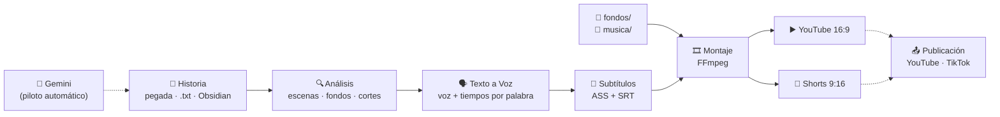

<p align="center">
  
</p>

<p align="center">
  <a href="https://github.com/manuurgzz/reddit-video/actions/workflows/tests.yml"></a>
  <a href="https://github.com/manuurgzz/reddit-video/tags"></a>
  
  
  
  
  
</p>

<p align="center">
  <a href="#características">Características</a> ·
  <a href="#instalación">Instalación</a> ·
  <a href="#uso">Uso</a> ·
  <a href="#documentación">Documentación</a> ·
  <a href="#hoja-de-ruta">Hoja de ruta</a>
</p>

---

**Reddit Video** es una app de escritorio para Windows que convierte una historia en texto (pegada en la app, un `.txt` o una nota de Obsidian) en vídeos listos para publicar: un vídeo completo para **YouTube** y una serie de **shorts verticales** para TikTok, Reels y YouTube Shorts que terminan en cliffhanger.

La voz en off, los subtítulos, la tarjeta del post de Reddit, los fondos y los cortes de los shorts se generan solos. Con el **piloto automático**, además, Gemini escribe historias nuevas y la app publica los vídeos cada día.

## Características

| | |
|---|---|
| 🎬 **Dos formatos a la vez** | Vídeo completo 16:9 con su `.srt` para YouTube y shorts 9:16 para TikTok, Reels y Shorts. |
| ✂️ **Cortes automáticos** | Parte la historia en shorts de ~2:30 que acaban en un punto de suspense y deja el final para YouTube. |
| 📋 **Cualquier texto** | Pega la historia tal cual o abre un `.txt`: sin formato especial ni Obsidian. |
| 🗣️ **Voz en off gratis** | Once voces neuronales en español (España, México, EE. UU., Colombia y Argentina) con el motor [Texto a Voz](Texto_Voz/), incluido. Cada proyecto sortea una y la recuerda. |
| 💬 **Subtítulos palabra a palabra** | De 2 a 4 palabras por golpe, sincronizados con la voz, con zoom en las frases en **negrita** y palabras clave en amarillo. |
| 🟧 **Tarjeta de Reddit** | El vídeo arranca con un post que imita uno real (`r/subreddit`, `u/usuario` y título), editable con vista previa. |
| 🧼 **Fondos por temática** | Clips *satisfying* o de gameplay, recortados o sobre fondo desenfocado según el formato. Un tema por short. |
| 🤖 **Piloto automático** | Gemini escribe las historias, tú las apruebas y la app crea los vídeos y los publica: programados en YouTube y como borrador en TikTok. |
| 📓 **Obsidian (opcional)** | Lee las notas de tu bóveda, marca los clips hechos y lleva el estado de cada historia. |
| ⚡ **Rápido y con caché** | GPU NVIDIA (NVENC) si la hay, modo de prueba rápida y caché de voz por línea: solo se regenera lo que cambia. |

## Cómo funciona



Las líneas discontinuas son los pasos del [piloto automático](docs/piloto-automatico.md). Los vídeos se guardan en `salida\<nombre de la historia>\`.

## Instalación

> **Requisitos:** Windows 10/11 y conexión a internet (la voz se genera online). El instalador se encarga de Python, las dependencias y FFmpeg.

1. **Descarga el proyecto** con **Code → Download ZIP** y descomprímelo donde quieras.
2. **Haz doble clic en `INSTALAR_Y_CREAR.bat`.** Instala lo que falte (Python 3.12, `requirements.txt` y FFmpeg mediante `winget`) y abre la app.
3. **Añade fondos.** Se crean las carpetas `fondos\JABON`, `SLIME`, `ARENA`, `PINTURA`, `PRENSA`, `RUNNER`, `PARKOUR` y `CERA`. Mete en cada una algún clip gratuito de Pexels o Pixabay (*soap cutting*, *slime*, *kinetic sand*, *paint pouring*, *hydraulic press*, *wax cutting*…).
4. **Música (opcional).** Mete archivos `.mp3` en `musica\` (por ejemplo, de la YouTube Audio Library o Pixabay Music).

A partir de ahí, basta con abrir **`crear_video.bat`**.

<details>
<summary><b>Más sobre los fondos</b></summary>

- Valen en vertical u horizontal: en los shorts se recortan y en YouTube se colocan sobre un fondo desenfocado.
- Si una carpeta está vacía, se usa otra que tenga clips.
- Un vídeo de más de 15 minutos se reutiliza para toda su temática, cogiendo trozos seguidos para no repetir.

</details>

<details>
<summary><b>Instalación manual</b> (sin el <code>.bat</code>)</summary>

```bat
winget install -e --id Python.Python.3.12
winget install -e --id Gyan.FFmpeg
python -m pip install -r requirements.txt
pythonw app.pyw
```

</details>

## Uso

### Desde la app

Abre **`crear_video.bat`** y sigue las cuatro tarjetas:

1. **Historia.** **＋ Pegar historia…** (título, subreddit y el texto tal cual) o elige una nota de la lista, con su estado (`pendiente`, `aprobada`, `hecha`…). Debajo ves cuánto dura, cuántos shorts salen y qué parte va solo en YouTube.
2. **Post de Reddit.** El subreddit sale de la historia y el usuario se inventa al azar (🎲 para otro). Todo es editable, con vista previa de la tarjeta.
3. **Voz.** Cada proyecto nuevo sortea una voz y la recuerda. **🎲 Otra al azar** para cambiarla y **▶ Escuchar** para oírla.
4. **Qué crear.** YouTube, Shorts o los dos; música; prueba rápida; gráfica NVIDIA.

Pulsa **Crear vídeos** y, al terminar, se abre la carpeta con el resultado. Con **Piloto automático…** la app lo hace todo sola cada día.

Para convertir cualquier texto a audio sin hacer vídeo, abre **`texto_a_voz.bat`** (la web de Texto a Voz en `http://localhost:8000`).

### Desde la terminal

```bash
python guion_a_video.py [historia.md|historia.txt] [opciones]
```

Sin ruta, usa la historia más reciente de la carpeta de guiones.

| Opción | Descripción |
|---|---|
| `--analizar` | Solo muestra lo que ha entendido (escenas, fondos, claves y cortes). |
| `--solo <qué>` | `todo` (por defecto), `youtube`, `cortes`, `parte1`, `parte2`… |
| `--rapido` | Prueba rápida a media resolución. |
| `--gpu` | Codifica con NVIDIA NVENC (si el PC no tiene NVIDIA, usa el procesador). |
| `--voz <id>` | Fuerza una voz, p. ej. `es-ES-ElviraNeural`. |
| `--velocidad <±N%>` | Velocidad de la voz, p. ej. `"+10%"`. |
| `--musica <archivo>` / `--sin-musica` | Elige la pista de música o la quita. |
| `--semilla <n>` | Repite exactamente la misma elección de fondos. |

El piloto automático también se maneja desde la terminal:

```bash
python automatizar.py --una-vez                        # una pasada ahora
python automatizar.py --programar 09:00                # una pasada al día (--desprogramar la quita)
python automatizar.py --conectar-youtube cliente.json  # o --conectar-tiktok
```

## Documentación

| Guía | Contenido |
|---|---|
| 🤖 [Piloto automático](docs/piloto-automatico.md) | Conectar Gemini, YouTube y TikTok, activar la pasada diaria y estados de cada historia. |
| ✂️ [Cortes automáticos](docs/cortes-automaticos.md) | Cómo decide la app dónde cortar los shorts y cómo ajustarlo. |
| 📝 [Formato del guion y Obsidian](docs/formato-del-guion.md) | Escenas, fondos, palabras en amarillo, mapa de cortes y notas de Obsidian. |
| ⚙️ [Configuración](docs/configuracion.md) | Ajustes del motor y archivos locales (`ajustes.json`, `secretos.json`, caché). |
| 📜 [Registro de cambios](CHANGELOG.md) | Evolución del proyecto, versión a versión. |

## Estructura del proyecto

```text
reddit-video/
├── app.pyw                 # Interfaz gráfica (Tkinter)
├── guion_a_video.py        # Motor: análisis, cortes, voz, subtítulos y montaje
├── automatizar.py          # Piloto automático: Gemini, pasada diaria y publicación
├── Texto_Voz/              # Motor de voz (voz.py) y su web (server.py)
├── crear_video.bat         # Abre la app
├── INSTALAR_Y_CREAR.bat    # Instala dependencias y abre la app
├── texto_a_voz.bat         # Abre la web de Texto a Voz
├── test_cortes.py          # Tests de los cortes automáticos
├── test_piloto.py          # Tests del piloto (sin conexión)
├── requirements.txt        # Dependencias de Python
├── guiones/                # Guion de ejemplo e historias pegadas en la app
└── docs/                   # Guías y recursos del README
```

`fondos/`, `musica/`, `fuentes/`, `salida/`, `.cache/`, `ajustes.json` y `secretos.json` se crean en tu PC y no se suben a Git.

## Desarrollo

Los tests se ejecutan en GitHub Actions (Windows) en cada push. En local:

```bash
python test_cortes.py           # cortes automáticos
python test_piloto.py           # piloto completo, con Gemini, YouTube y TikTok simulados
python Texto_Voz/test_server.py # servidor de voz (necesita internet)
```

## Hoja de ruta

- [x] Vídeo de YouTube y shorts desde un solo guion
- [x] Integración con Obsidian (lectura de notas y checklist de clips)
- [x] Interfaz con tema oscuro y vista previa del post
- [x] Cortes automáticos de los shorts y texto normal sin formato
- [x] Piloto automático: Gemini escribe, la app crea los vídeos y los publica
- [ ] Publicación directa en TikTok (*Direct Post*, necesita otra revisión de TikTok) y en Instagram Reels
- [ ] Notas de edición finas (congelar imagen, pantalla partida…)

## Aviso sobre contenidos

Los clips de fondo, la música y las historias pertenecen a sus autores. Usa solo material que tengas derecho a usar (sobre todo el gameplay de `RUNNER` y `PARKOUR`), respeta las normas de Reddit y de cada plataforma, y marca el contenido como generado o alterado cuando te lo pidan. Las historias que escribe el piloto se publican como ficción.
